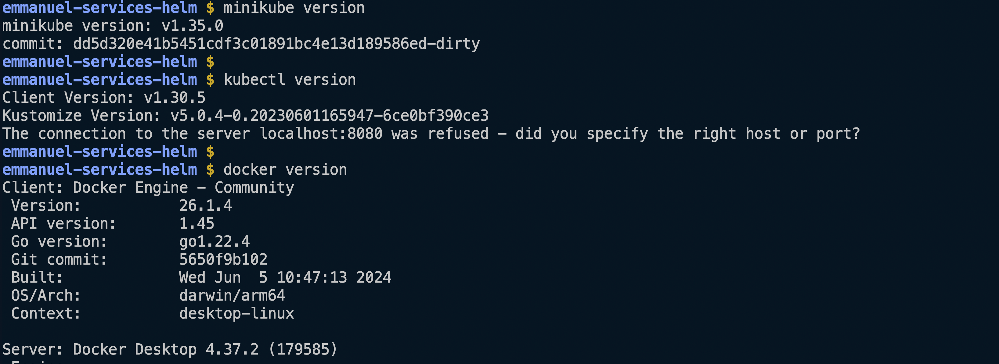
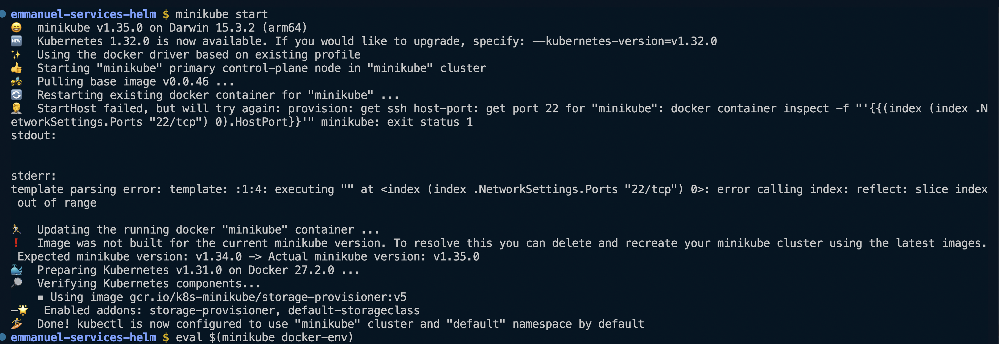
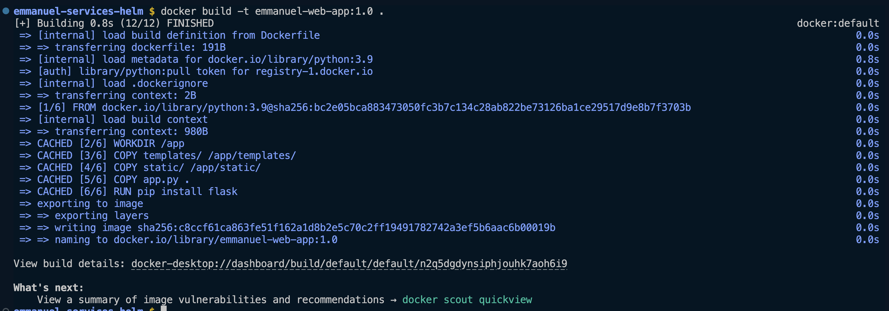
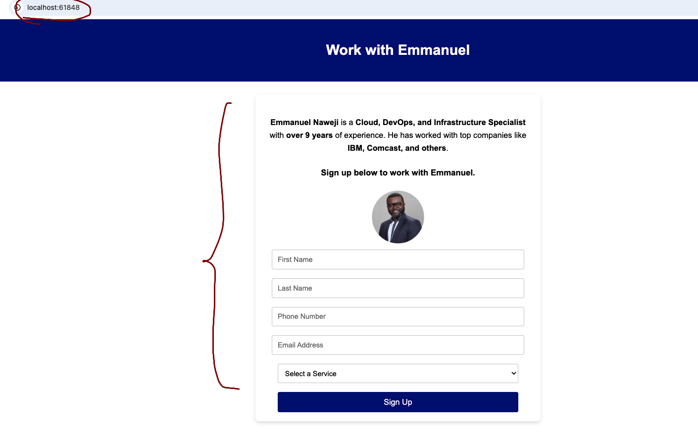

# Emmanuel Services – Work with Emmanuel (Deployed on Minikube using Helm)

This project shows how to deploy a full-stack web application using Helm and Minikube. The form is presented via an HTML frontend that promotes working with Emmanuel Naweji.

## Preview

Landing Page Sample:
- “Work with Emmanuel” branding
- Emmanuel’s picture
- [Book a FREE consultation](https://here4you.setmore.com)

## Project Layout

```
emmanuel-services/              
├── Dockerfile                # Flask backend Docker image
├── emmanuel-web-helm-chart/
│   ├── Chart.yaml
│   ├── values.yaml
│   └── templates/
│       ├── deployment.yaml
│       ├── service.yaml
├── static/
│   └── emmanuel-thumbnail.jpg  # Emmanuel’s branding 
├── templates/
│   └── index.html              # Frontend form with Emmanuel’s branding
├── app.py                      # Flask API for form submission handling
```

## Prerequisites

- Docker
- Minikube
- Helm
- kubectl

.

## Step-by-Step Deployment Instructions

### 1. Start Minikube

```bash
minikube start
eval $(minikube docker-env)
```
.

Minikube gives us a local Kubernetes cluster for dev/testing.

### 2. Build the Flask Backend Image

Dockerfile:

```Dockerfile
FROM python:3.9

WORKDIR /app

COPY templates/ /app/templates/
COPY static/ /app/static/
COPY app.py .

RUN pip install flask

CMD ["python", "app.py"]
```

Build it:

```bash
docker build -t emmanuel-web-app:1.0 .
```

.


This image handles POST requests from the HTML form and writes data to PostgreSQL.

### 3. Configure Helm Chart

Create a **Chart.yaml** file

```yaml
apiVersion: v2
name: emmanuel-services
description: Helm chart for deploying the Emmanuel Services web application
version: 0.1.0
```

### 4. Configure Helm Values
Create a **values.yaml** file

```yaml
replicaCount: 1

image:
  repository: emmanuel-web-app
  tag: "1.0"
  pullPolicy: IfNotPresent

service:
  type: NodePort
  port: 80
```

### 5. Configure Template Files
- 1. Create a **deployment.yaml** file

```yaml
apiVersion: apps/v1
kind: Deployment
metadata:
  name: emmanuel-services
spec:
  replicas: {{ .Values.replicaCount }}
  selector:
    matchLabels:
      app: emmanuel-services
  template:
    metadata:
      labels:
        app: emmanuel-services
    spec:
      containers:
        - name: emmanuel-web
          image: "{{ .Values.image.repository }}:{{ .Values.image.tag }}"
          imagePullPolicy: {{ .Values.image.pullPolicy }}
          ports:
            - containerPort: 80
```

- 2. Create a **service.yaml** file

```yaml
apiVersion: v1
kind: Service
metadata:
  name: emmanuel-services
spec:
  type: {{ .Values.service.type }}
  selector:
    app: emmanuel-services
  ports:
    - protocol: TCP
      port: {{ .Values.service.port }}
      targetPort: 80
```


### 6. Deploy using Helm

```bash
helm install emmanuel-services ./emmanuel-web-helm-chart
```

.


### 7. Access the App

```bash
minikube service emmanuel-services --url
```

.


Open the URL in your browser to access the Work with Emmanuel form.

Make sure your Flask app endpoint matches the frontend fetch URL (e.g. /signup).

## Why These Steps Matter

| Step             | Purpose                                        |
|------------------|----------------------------------------------- |
| Docker           | Containerizes the backend logic                |
| Flask            | Handles POST request logic and DB connection   |
| Helm             | Manages Kubernetes configuration declaratively |
| Minikube         | Local dev environment to test the full setup   |
| values.yaml      | Defines configuration values                   |
| deployment.yaml  | A template that uses values from values yaml   |
| service.yaml     | Another template that uses values              |
| Chart.yaml       | Metadata about the chart (name, version, etc.) |
| app.py           | Backend code, usually written in Python (Flask)|
| index.html       | Displayed in browser                           |
| Dockerfile       | Container builder packaging for deployment     |
| static/          | Assets for the frontend referencing index.html |


.

---

## Cleanup

```bash
helm uninstall emmanuel-services
minikube stop
```

.

---

## Next Steps
- Provide a PosgreSQL database to store data. 
- Move the Infrastructure to AWS (and other Cloud Platforms. E.g.: Azure, Google, etc.). 
- Make the infra scalable leveraging Cloud Native Kubernetes. 

---

## Book a Free Consultation

[Schedule with Emmanuel](https://here4you.setmore.com)

---
MIT License © 2025 Emmanuel Naweji

You are free to use, copy, modify, merge, publish, distribute, sublicense, or sell copies of this software and its associated documentation files (the “Software”), provided that the copyright and permission notice appears in all copies or substantial portions of the Software.

This Software is provided “as is,” without any warranty — express or implied — including but not limited to merchantability, fitness for a particular purpose, or non-infringement. In no event will the authors be liable for any claim, damages, or other liability arising from the use of the Software.
